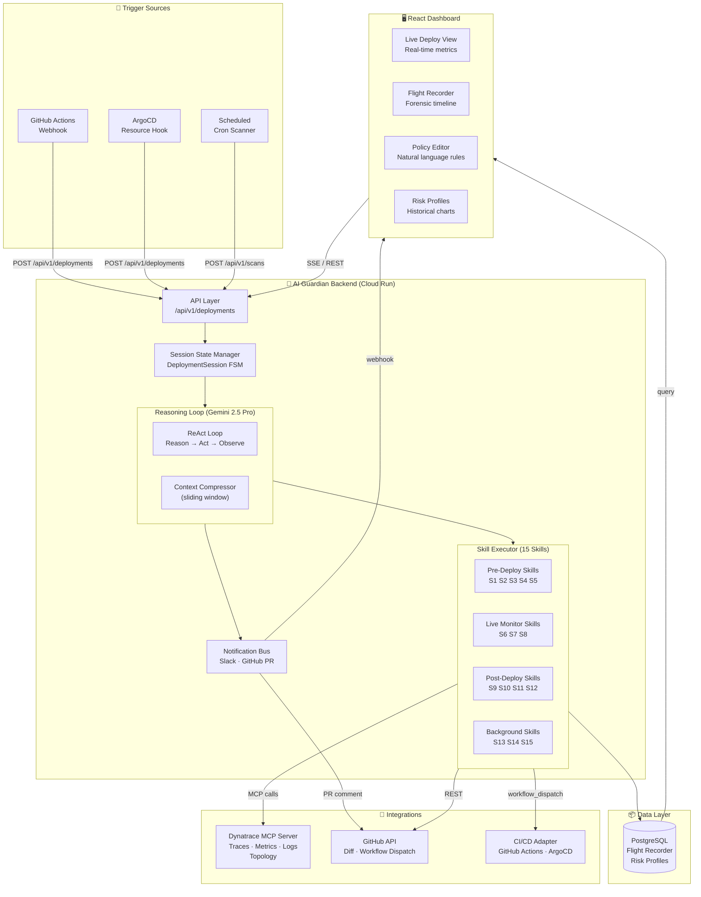
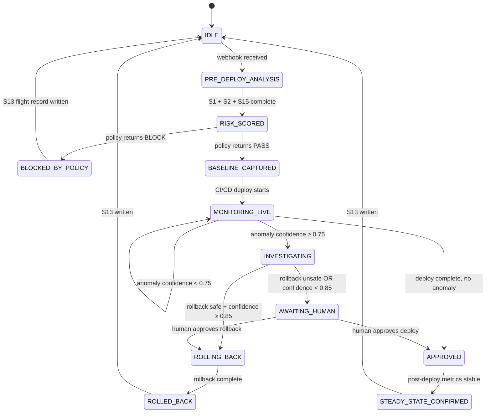
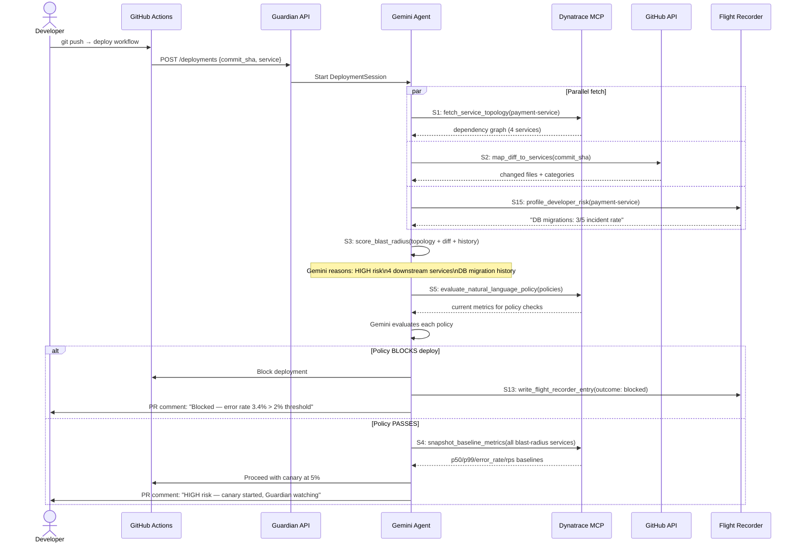
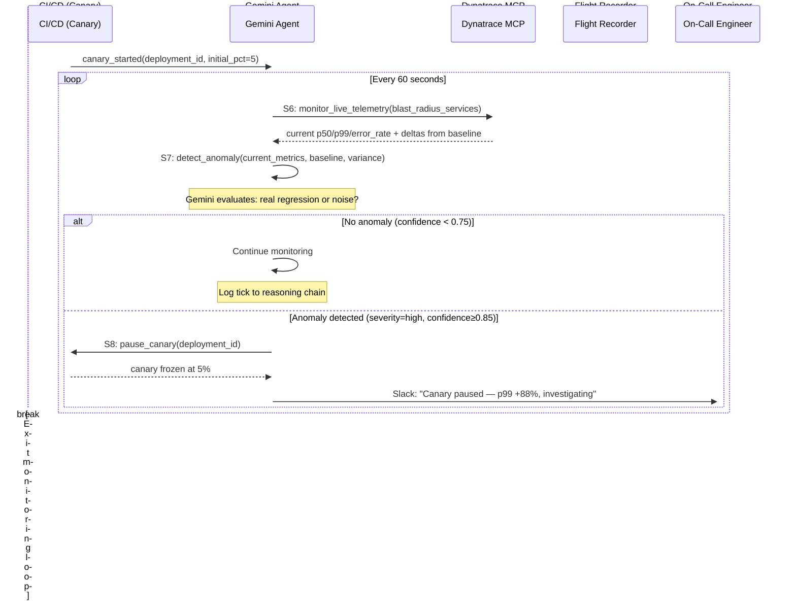
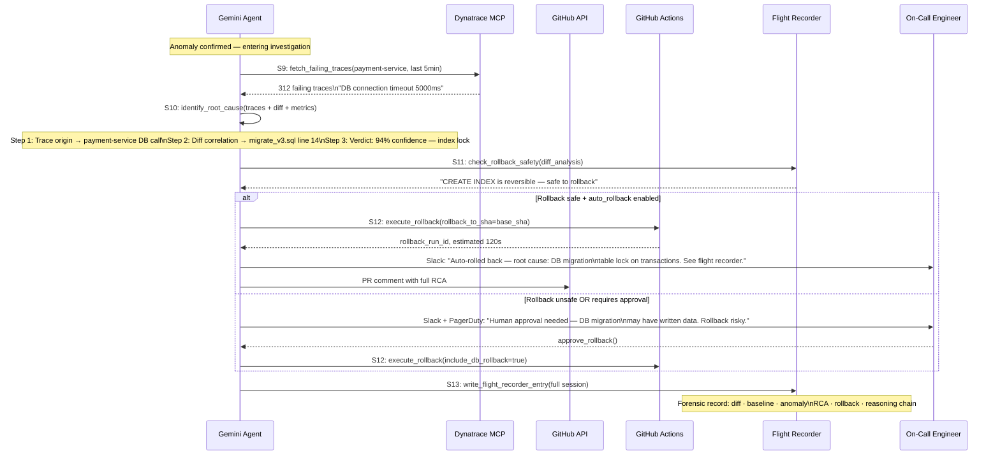
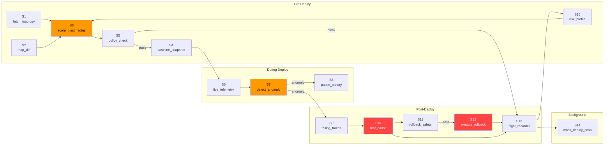
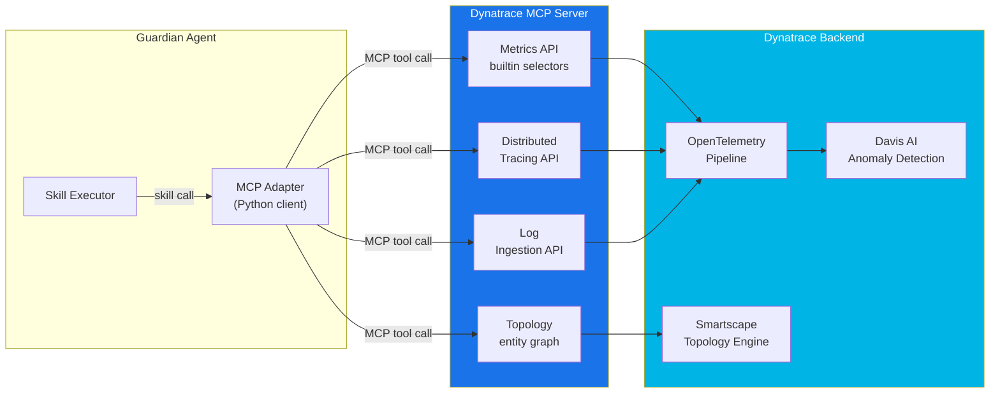
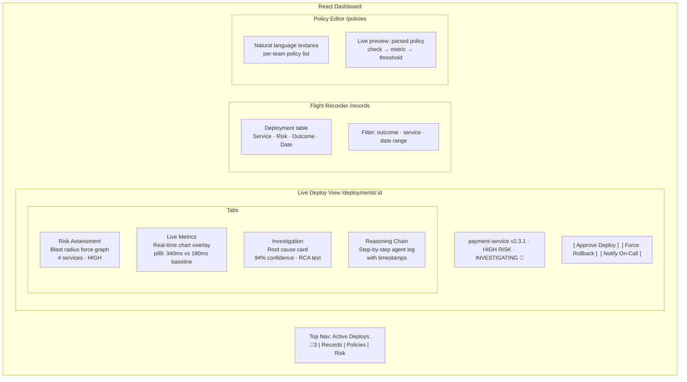

# AI Deployment Guardian — Architecture Diagrams

---

## 1. System Architecture Overview

---

## 2. Deployment Lifecycle — State Machine

---

## 3. Pre-Deploy Phase — Skill Orchestration

---

## 4. Live Monitoring Phase — Anomaly Detection Loop

---

## 5. Post-Deploy Investigation & Rollback

---

## 6. Skill Dependency Graph

---

## 7. Data Flow — Dynatrace MCP Integration

---

## 8. Frontend Dashboard Layout

